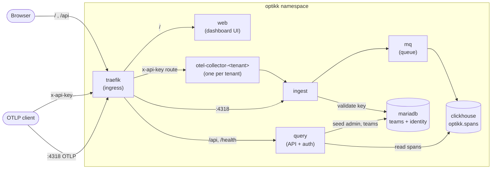

# optikk

A single CLI to provision the **entire Optikk stack from prebuilt container images** and
operate it on a **local kind cluster**. It turns a manual, order-sensitive runbook into a
handful of health-gated commands.

- **Module:** `github.com/optikklabs/optikk` · **Go:** 1.26 · **CLI:** Cobra
- The Kubernetes manifests are **embedded** in the binary (`assets/deploy`, via `go:embed`) —
  no external manifest tree to clone.
- The binary is **minimal (~8 MB)**: it orchestrates, and shells out to **podman, kind, and
  kubectl** for the heavy lifting — the same model kind itself uses with podman/docker. The
  tools are checked up front; missing ones fail fast with install instructions.
- Release builds are static, stripped, and installable with `go install`, Homebrew, or a
  tarball from GitHub Releases.
- Environment is a **`--target local` flag**, not a subcommand. The top-level verbs
  (`up`, `down`, `status`, `verify`, `tenant`, `admin`, `team`) provision infra from scratch.

---

## Contents

- [What `up` deploys](#what-up-deploys)
- [Container images used](#container-images-used)
- [Architecture](#architecture)
- [Data flow: how a trace lands](#data-flow-how-a-trace-lands)
- [`up` provisioning flow](#up-provisioning-flow)
- [Install / build](#install--build)
- [Quick start (local)](#quick-start-local)
- [Command reference](#command-reference)
- [Configuration](#configuration)
- [Resource sizing](#resource-sizing)
- [Project layout](#project-layout)
- [Extending the CLI](#extending-the-cli)
- [Troubleshooting](#troubleshooting)
- [Status](#status)

---

## What `up` deploys

`up` brings up the **whole stack** in the `optikk` namespace. No component is optional in v1.

| Component | Role |
|---|---|
| **traefik** | Ingress. Routes `/api`, `/swagger`, `/health` to query; `/` to web; `x-api-key` header to the matching tenant otel-collector; `:4318` OTLP to ingest. |
| **web** | Dashboard UI (nginx). |
| **query** | Read/query API + auth (JWT). Seeds the super-admin on boot. |
| **ingest** | Validates the tenant `x-api-key` against MariaDB, writes spans toward ClickHouse via mq. |
| **otel-collector** | **One per tenant.** Receives OTLP, forwards to ingest. Created by `tenant onboard`. |
| **mq** | Message queue / buffering between ingest and ClickHouse. |
| **clickhouse** | Span store (`optikk.spans`). |
| **mariadb** | Tenant/team + identity store. |
| **metrics-server** | Installed by `up --target local` (with `--kubelet-insecure-tls`) so HPA/`kubectl top` work on kind. |

---

## Container images used

The CLI **never builds images inside the cluster** — it applies manifests and Kubernetes pulls
the images. **All images are public**, so the default path needs no registry auth.

### Application images (`ghcr`, public)

| Image | Component |
|---|---|
| `ghcr.io/optikklabs/ingest:latest` | ingest |
| `ghcr.io/optikklabs/query:latest` | query |
| `ghcr.io/optikklabs/web:latest` | web |
| `ghcr.io/ramantayal12/mq:latest` | mq |

These ghcr packages are public — Kubernetes pulls them directly, no credentials required.

**Optional `--load-local-images` (local target):** for air-gapped/offline runs or when testing a
locally-built image, pass this flag to `up --target local`. The CLI runs `podman save -m` on the
four images already present on the host and imports the archive with `kind load image-archive`.
Not needed for a normal run.

### Upstream images (public)

| Image | Component |
|---|---|
| `clickhouse/clickhouse-server:26.6` | clickhouse |
| `mariadb:11.4` | mariadb |
| `otel/opentelemetry-collector-contrib:0.155.0` | otel-collector (per tenant) |
| `traefik:v3.3` | traefik |
| `busybox:1.36` | init containers (ingest/query) |

Pulled directly from their public registries; never loaded locally.

---

## Architecture



**Ingress / storage (local — kind on Podman):** host `:8080` → Traefik web, host `:4318` →
OTLP ingest, mq + ClickHouse on local PVCs.

---

## Data flow: how a trace lands

`verify` exercises this exact path end-to-end.

```mermaid
sequenceDiagram
    participant C as client
    participant T as traefik
    participant O as otel-collector-&lt;tenant&gt;
    participant I as ingest
    participant M as mariadb
    participant Q as mq
    participant CH as clickhouse

    C->>T: OTLP POST /v1/traces (x-api-key: KEY)
    T->>O: route by x-api-key
    O->>I: forward spans
    I->>M: validate KEY against teams
    M-->>I: tenant ok
    I->>Q: enqueue spans
    Q->>CH: write to optikk.spans
    Note over C,CH: verify then polls SELECT count() FROM optikk.spans (async, ~30s)
```

Two gotchas the CLI accounts for:

1. **A fresh cluster has no tenant whose key matches the collector.** Teams are created via the
   API (`team create`), not seeded. So the first-run order is: `up → admin login → team create →
   tenant onboard --key <key> → verify --api-key <key>`.
2. **ingest caches a failed key lookup for ~5 minutes** (negative cache). If you seed/create a
   team *after* a key was already tried, `kubectl -n optikk rollout restart deploy/ingest` clears it.

---

## `up` provisioning flow

### `up --target local`

```
check required tools on PATH (podman, kind, kubectl) — fail fast with install instructions
precheck podman machine (rootful? running? ≥5 vCPU / ≥8 GiB / ≥40 GiB disk)
  └─ short? fail with the exact `podman machine set ...` command  (or run it with --manage-podman)
create kind cluster "optikk"  (deploy/kind/kind-config.yaml)   [reused if it already exists]
lift pids-limit on the node container
[--load-local-images] podman save 4 app images  ->  kind load image-archive
install metrics-server (+ --kubelet-insecure-tls)
kubectl apply -k deploy/overlays/local  (server-side, retried while CRDs register)
wait for all Deployments + StatefulSets to roll out
ready -> query API at http://localhost:8080
```

`down` reverses it: deletes the kind cluster (or just the stack with `--keep-cluster`).

---

## Install

The Kubernetes manifests are embedded, so `optikk` runs from any directory with no external
files to clone.

### Prerequisites

The CLI shells out to three standard tools; `up` checks for them and prints these commands if
any is missing:

| Tool | Install (macOS) | Docs |
|---|---|---|
| **podman** (rootful machine, ≥8 GiB RAM) | `brew install podman` | https://podman.io/docs/installation |
| **kind** | `brew install kind` | https://kind.sigs.k8s.io/docs/user/quick-start/#installation |
| **kubectl** | `brew install kubectl` | https://kubernetes.io/docs/tasks/tools/ |

```bash
# Homebrew (macOS/Linux, after the release tap is published)
brew install optikklabs/tap/optikk

# Go (any platform, Go 1.26+)
go install github.com/optikklabs/optikk@latest

# Raw binary (macOS/Linux, amd64/arm64) — from a GitHub Release
curl -L https://github.com/optikklabs/optikk/releases/download/vX.Y.Z/optikk_X.Y.Z_darwin_arm64.tar.gz | tar xz
./optikk --help
```

### Run via `go install`

`go install` drops the `optikk` binary in `$(go env GOPATH)/bin`. Add that to your `PATH`, then run it directly:

```bash
go install github.com/optikklabs/optikk@latest
export PATH="$(go env GOPATH)/bin:$PATH"   # add to your shell profile to persist

optikk --help      # verify install
optikk up          # provision the local (kind) stack
```

Build from source: `make build`; install to `/usr/local/bin` with `make install` or override
`PREFIX=/path make install`. Developing against a live manifest tree instead of the embedded
copy? Point at it with `--deploy-dir PATH`.

---

## Quick start (local)

```bash
# 1. Check local tools, then provision cluster + full stack
optikk doctor
optikk up                                # add --load-local-images only for offline/local builds

# 2. Health + trace roundtrip against the default tenant key
optikk verify

# 3. Seed + cache the platform super-admin
optikk admin setup
optikk admin login                       # defaults: admin@optikk.dev / Password123!

# 4. Create a team -> get its api_key (this is the tenant key)
optikk team create demo                  # prints team_id, slug, api_key K
optikk team member add u@x.com --team <id> --password 'Secret123!'

# 5. Onboard a per-tenant collector and verify with its key
optikk tenant onboard demo --key K
optikk verify --api-key K

# 6. Inspect / tear down
optikk status
optikk down
```

---

## Command reference

Persistent flags (all commands): `--target local` (default `local`) · `--config PATH` ·
`--deploy-dir PATH` · `--verbose/-v`.

### `optikk doctor`
Check that `podman`, `kind`, and `kubectl` are installed before provisioning.
Aliases: `check`, `preflight`.

### `optikk up`
Provision infra from scratch + deploy the full stack for `--target`.
`[--manage-podman] [--load-local-images] [--timeout 10m]`
Aliases: `start`, `deploy`.

### `optikk down`
Tear down the stack + the cluster it created. `[--keep-cluster]`
Aliases: `stop`, `destroy`.

### `optikk status`
List `optikk`-namespace pods + readiness for `--target`.
Aliases: `ps`, `pods`.

### `optikk verify`
`/health` 200 → POST one OTLP trace with `x-api-key` → assert the ClickHouse span count rose
(polls up to 30s; ingestion is async). `[--api-key c3448fae] [--trace-file <deploy>/example-trace.json]`
Alias: `smoke`.

### `optikk tenant onboard <slug> --key KEY` / `optikk tenant offboard <slug>`
Materialize `deploy/tenants/_template` for `<slug>`, create `otel-collector-<slug>-secret`,
render + apply (or delete) the per-tenant otel-collector.

### `optikk admin setup` / `optikk admin login`
- `setup [--email E] [--password P]` — patch query's admin secret and restart so query reseeds
  the super-admin (**create-if-absent**: an existing admin's password is unchanged).
- `login [--email E] [--password P]` — `POST /api/v1/auth/login`, cache the JWT at
  `~/.optikk/token.json` for the `team` commands.

### `optikk team create <name>` / `optikk team member add <email>`
- `create <name> [--org O] [--slug S]` — admin-gated; prints `team_id`, `slug`, `api_key`
  (the `api_key` is what `tenant onboard --key` consumes).
- `member add <email> --team ID --password P [--name N] [--role R]` — admin-gated; creates a
  user assigned to the team (there is no dedicated member endpoint — this maps to create-user).

### `optikk config show` · `optikk completion` · `optikk version`
Print the merged config; generate shell completion for `bash`, `zsh`, `fish`, or `powershell`;
print version, commit, and build date.

---

## Configuration

Precedence: **defaults → `optikk.yaml` (cwd) or `~/.optikk/config`/`~/.optikk/optikk.yaml` → `OPTIKK_*` env → flags**.
Example `optikk.yaml`:

```yaml
target: local
admin:
  email: admin@optikk.dev
  password: Password123!
```

State the CLI writes: the admin session cache at `~/.optikk/token.json` (per API base).

---

## Resource sizing

Pod resource **requests** live in `deploy/` and are applied unchanged. The CLI owns **VM**
sizing and validates the host floor before `up`.

### Local — kind on Podman
Cluster total for 1 tenant ≈ **1.5 vCPU / ~3 GiB / ~12 GiB disk**. Podman machine floor the CLI
enforces: **≥5 vCPU, ≥8 GiB RAM (hard floor — less and ClickHouse OOMs), ≥40 GiB disk**, rootful
and running. Short? `up` fails with the exact `podman machine set --cpus/--memory/--disk-size`
command (or fixes it with `--manage-podman`).

---

## Project layout

```
pro/optikk/
  main.go                 cobra Execute()
  assets/                 embedded deploy/ kustomize tree (go:embed) + Materialize()
  cmd/                    one file per command; root.go wires target + persistent flags
    up down status verify tenant admin team config version   (+ root)
  internal/
    config/               lightweight YAML/env loader; flags override in cmd/root.go
    deploypath/           resolve manifests (embedded assets/deploy, or --deploy-dir override)
    prereq/               fail-fast checks for podman/kind/kubectl with install hints
    hostexec/             podman machine precheck (+ opt-in manage), pids-limit
    localcluster/         kind create/delete/load via the kind CLI (Podman provider)
    kubectl/              kubectl runner bound to the cluster's kubeconfig context
    k8sapply/             kubectl apply -k (server-side, CRD-retry) + rollout waits,
                          metrics-server install
    provision/            Local "up/down" orchestrator
    target/               resolve live conn (kubectl context + API/OTLP base) per target
    verify/               /health + OTLP roundtrip + ClickHouse count assert (kubectl exec)
    status/               pod readiness table
    tenant/               onboard/offboard per-tenant otel-collector
    apiclient/            query API client: login (JWT cache) + CreateTeam/CreateUser
    adminseed/            patch query admin secret + restart to reseed
```

---

## Extending the CLI

- **New command:** add `cmd/<name>.go` exposing `func newXCmd(app *App) *cobra.Command` and add
  one line to the `root.AddCommand(...)` list. Shared state (config, deploy dir) hangs off the
  injected `*App` — no globals, no edits to existing commands.
- **New target** (e.g. EKS): implement the `up`/`down` orchestrator in `internal/provision` and
  resolve its connection in `internal/target`. `k8sapply`, `verify`, and rollout-wait are shared,
  so a new target reuses the apply/verify path unchanged.

---

## Troubleshooting

| Symptom | Cause / fix |
|---|---|
| `up` refuses at precheck | Podman machine below floor or not rootful/running — run the printed `podman machine set ...` (or use `--manage-podman`). |
| `missing required tools` on `up` | Install the printed tools (podman/kind/kubectl) — the error includes the exact brew command and docs link for each. |
| Offline images | Images are public so a normal `up` pulls them; for air-gapped runs use `--load-local-images` (the 4 app images must exist on the host — `podman images`). |
| `verify` span count stays 0 | No team matches the tenant key on a fresh cluster — `team create` then `tenant onboard --key`. If a key was tried too early, `kubectl -n optikk rollout restart deploy/ingest` clears the 5-min negative cache. |
| `login` 405 | The query API is under `/api` (Traefik `PathPrefix(/api)`); the client already targets `<base>/api`. |
| `team`/`admin` commands say no session | Run `optikk admin login` first (caches JWT at `~/.optikk/token.json`). |

---

## Status

| Milestone | State |
|---|---|
| M0 scaffold + git repo + config | ✅ verified |
| M1 `up`/`down --target local` | ✅ verified (full destroy + from-scratch rebuild) |
| M2 `status` + `verify` | ✅ verified (0→1 span roundtrip) |
| M4 `tenant onboard/offboard` | ✅ verified (keyed trace lands, cleanup works) |
| M5 `admin` + `team` | ✅ verified (login, team create, member add, reseed) |
| M3 `up`/`down --target gcp` | ❌ removed — the CLI is local-only; cloud targets are out of scope for the minimal binary |
